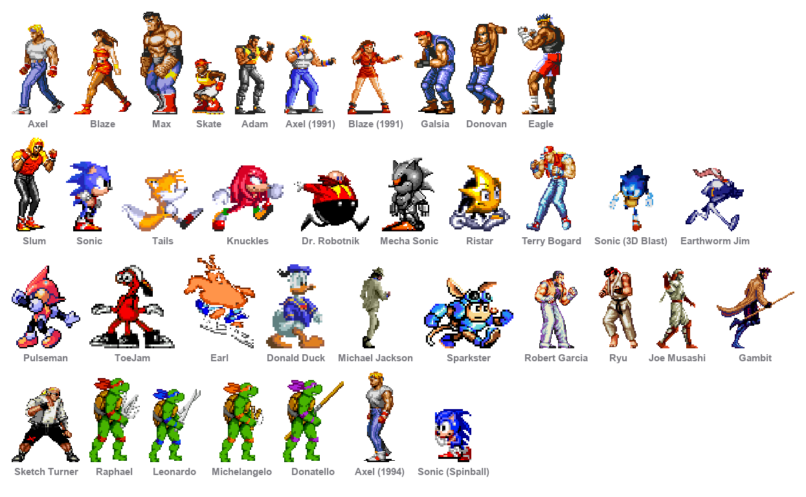
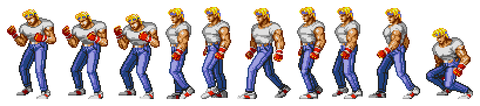
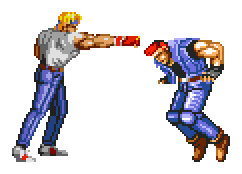

# MegaDrive Buddies

[](https://github.com/shadi0077/megadrive-buddies/actions/workflows/ci.yml)
[](LICENSE)
-lightgrey)

Eleven Streets of Rage characters who live on your macOS desktop. They pace the
length of the screen at walking pace, throw the odd punch, and when two of them
end up near each other they square up and have a go.

They don't talk. They grunt, thud and shout, using the game's own sound
effects, and their conversations are entirely physical.

**No network access, no analytics, no bundled anything, no upsell.** They are
windows that draw a sprite. Quit them from the menu bar and they're gone.



📖 **[shadi0077.github.io/megadrive-buddies](https://shadi0077.github.io/megadrive-buddies/)**

Split out of **[Desktop Buddies](https://github.com/shadi0077/desktop-buddies)**,
which is the same engine with the talking left in — nine Microsoft Agent
characters who tell jokes, sing, and argue with each other.

---

## Build and run

macOS 11 or later on Apple Silicon, plus the Xcode command line tools.

```bash
git clone https://github.com/shadi0077/megadrive-buddies.git
cd megadrive-buddies
./build.sh && open "build/MegaDrive Buddies.app"
```

> **On the artwork.** The sprites and sounds are Sega's, ripped from Streets of
> Rage. They're included so this runs from a clone, but they are **not** covered
> by the MIT licence and are not mine to license — see
> [docs/SPRITES.md](docs/SPRITES.md). Rights holders: open an issue and it comes
> down.

There is no Xcode project. `build.sh` compiles the sources with `swiftc`,
assembles the `.app`, and ad-hoc signs it. The whole build is about seven
seconds and seven megabytes.

## The cast

| | |
|---|---|
| **Streets of Rage 2** | Axel, Blaze, Max, Skate |
| **Streets of Rage 1** | Adam, Axel (1991), Blaze (1991) |
| **Enemies** | Galsia, Donovan, Eagle, Slum |

Both games have an Axel and a Blaze, seven years apart, so the older pair carry
the year in the menu. Have one of them out, or all eleven.

They're told apart by how they move rather than by what they say, because there
is nothing to say:

| | distance | speed | beat | restlessness |
|---|---|---|---|---|
| Axel | 600–2200 | 165 pt/s | 7–16 s | 2.6 |
| Blaze | 600–2200 | 190 pt/s | 6–14 s | 2.6 |
| Max | 500–1600 | 120 pt/s | 11–24 s | 1.6 |
| Skate | 900–3000 | 300 pt/s | 5–11 s | 3.4 |
| Enemies | 300–1600 | 130–160 pt/s | 9–24 s | 0.8–2.2 |

Max is a slow, heavy man who doesn't go far. Skate is a teenager on
rollerblades who never stops. The enemy rips are small — a handful of poses
each — so their repertoire is short and their beats are sparse: better a
character who stands there convincingly than one who cycles three frames every
four seconds.

## Walking



They walk, so they travel at walking pace and go a long way with it — across
the screen, not a hop and a stop. `Roaming` carries a distance range, a speed
in points per second and a restlessness, because a walk cycle played while the
window jumps 500 points in half a second reads as moonwalking, which is exactly
what it looked like before this existed.

Measured on Axel: 102 position changes over one stretch, 1846 points travelled,
largest single step 38 points.

Direction is picked from the room actually available, so somebody parked against
an edge never chooses a target that clamps back onto itself, and the travel is
eased in and out so a walk starts and stops rather than snapping to full speed.

## Squaring up



Two of them within 420 points of each other stop wandering and have a go. It
has the shape of a conversation — take turns, face each other, nobody moves
while somebody else is mid-swing — with the content physical: one swings, the
other blocks or takes it, then counters.

**Let Them Fight** in the menu walks two of them together first, rather than
waiting for the wandering to bring them close.

Facing matters here. Every sprite set faces the viewer's left unmirrored, so
turning to face somebody means mirroring — and whoever isn't swinging still
turns to watch.

## Sound instead of speech

`SoundBank` plays short one-shots through `AVAudioPlayer`. Every animation makes
a fitting noise, chosen by clip name: specials and celebrations shout,
knockdowns thud, everything else grunts.

The rip names voice clips `V00`–`V52` and effects `00`–`49`, with no index of
what each one is — nobody wrote down which grunt is which. The grouping is by
that naming convention plus duration: short voice clips are exertion, short
effects are impacts, longer voice clips are shouts. It's an inference, not a
transcription, and it holds up because the categories are coarse.

**Volume is theirs alone** — a slider in the menu, independent of the system
volume. Turning them down doesn't quieten anything else, and turning the Mac up
doesn't make them shout.

`AVAudioPlayer` is deliberate rather than incidental: these want firing and
forgetting, and `play()` returns false on a dead audio device instead of raising
the uncatchable ObjC exception `AVAudioPlayerNode` does.

## Feeling alive

A desktop pet is dead the moment you can feel the timer behind it. Four things
do most of the work:

**Energy.** A single 0–1 value that rises when something happens to them and
decays back toward a baseline. Everything about the rhythm reads off it — the
gap between beats, and which kind of beat gets picked. Lively means shorter gaps
and more moving about; winding down means small, still beats and long pauses.
Without it every gap is drawn from the same flat distribution and the tempo
never changes.

**They know whether you're there.** `CGEventSource.secondsSinceLastEventType`
gives seconds since the last keyboard or mouse event, needs no permission at
all, and is the difference between a pet and a screensaver. Away for three
minutes and the baseline drops to 0.12 — they settle rather than performing to
an empty room.

**They notice the cursor.** Come within 250 pt and they turn and point at it;
shoot past and they startle. This is edge-triggered on the cursor *arriving*,
not level-triggered on it being nearby — the first version greeted a parked
cursor every nine seconds forever, which reads as a stuck loop rather than
attention. There's also a speed floor, so a motionless cursor doesn't count as
an arrival when it's the character who moved.

**They get bored of you.** Poke one repeatedly and the reaction decays:
startled, then playful, then visibly tiring of it, then nothing at all. Stop for
seven seconds and it resets. Paired with a short memory of recent animations, so
the same move doesn't come up three pokes running.

Not every beat produces a movement, either. A settle beat is often just standing
guard, which is what these characters spend most of their time doing.

### A soft-lock worth knowing about

A "bit" — guard then punch, knocked down then back up — owns the animator across
its whole intro/loop/outro sequence and hands back through a deferred callback
guarded by a generation token. Drop the callback and the character is stranded
mid-bit forever. That has genuinely happened twice, so `Brain.tick` carries a
60-second backstop that returns anyone stuck in `.busy` to idle.

## Using them

| | |
|---|---|
| Click | They react |
| Drag | Pick one up and put it somewhere else |
| Right-click | Same menu as the menu bar |
| Menu bar icon | Do Something, Let Them Fight, Do a Trick, Who's Here, volume, per-character controls |

**Liveliness** controls how often they do anything: Calm, Occasional (default),
Restless. It scales each character's own pacing rather than replacing it, so
Max stays slower than Skate at every setting — `test.sh` asserts exactly that.
**Size** is Small / Medium / Large. **Mute Sounds** silences everyone in one
click. All of it persists between launches, including who was on screen and
where they were standing.

They are non-activating floating panels, so they never steal focus, follow you
across Spaces, and sit above normal windows without blocking clicks — only the
opaque pixels of the sprite itself take mouse events.

### Can't see the menu bar icon?

It's whoever is out, in miniature — 18pt, cut from the sprite sheet. The sheets
that have portrait art end with it, and a portrait reads far better at that size
than an action frame, which flattens into an unreadable blob.

If it isn't showing at all, something is hiding it rather than failing to create
it. **Bartender, Ice** and similar menu-bar managers hide unrecognised items by
default; look in their hidden-items list. macOS also parks items off-screen when
the bar is full, which on a notched MacBook happens sooner than you'd expect.

Either way you're never locked out: **right-clicking any character opens the
same menu.** The item sets an `autosaveName`, so once you place or unhide it,
that choice sticks.

## Compatibility

**macOS 11 Big Sur and later, Apple Silicon** — every macOS version that has
ever shipped on an Apple Silicon Mac. `test.sh` asserts the binary's `minos` and
`Info.plist` agree on 11.0 and that an arm64 slice is present, so this can't
regress quietly.

One thing degrades rather than breaks on older systems: **Open at Login** offers
to open Login Items in System Preferences on macOS 11–12, and is a one-click
toggle via `SMAppService` from 13 on. The menu-bar icon is cut from the sprites
rather than an SF Symbol, so it looks the same everywhere; the SF Symbol is only
a last-resort fallback if the sprites can't be loaded at all.

For Intel Macs as well, build each slice and `lipo` them together — the sources
need no changes.

## Cutting the sheets

The rips arrive as one image per character with frames laid out in irregular
rows. `tools/sheet.py` segments it: find horizontal bands of content, then
columns within each band, then split each column at its own vertical gaps, then
trim every frame to its bounding box. Frames are anchored bottom-centre on a
shared canvas so their feet stay planted.

Bands map almost one-to-one onto animations — idle, walk, jab, kick, the Grand
Upper, knockdown, and the portrait art at the end. *Almost*, and the exceptions
are the whole job. Three have bitten:

**Captions live inside frames.** A label printed next to a sprite is part of the
same run of content, so it lands in that frame. Those frames are a normal size,
so no filter catches them. Blaze's walk starts two frames later than it looks
like it should for this reason. I tested whether an unusually-short-frame rule
would help; it would have thrown away her projectile and her lying-down poses
instead.

**A column can hold two sprites.** Wherever a sheet packs a short second row,
one column of a band contains two stacked sprites — and they come out as a
single frame. Galsia shipped like that: a man with a second man growing out of
his head. Nothing about the frame's size gives it away. The cutter now splits
columns at their own gaps, and `test.sh` checks every shipped frame holds
exactly one sprite, so this particular embarrassment can't come back.

**The Streets of Rage 1 rips have no whole-body walk.** That game composited a
walk from separate torso and leg sprites, so frames 3–10 of each character are
disembodied legs. The trio glide on their idle and roam much less, which is
better than animating a pair of trousers across the desktop.

The pipeline, end to end:

```bash
./setup.sh galsia ~/Downloads/galsia.png   # cut the sheet, render the index
python3 tools/index.py galsia              # numbered contact sheet — look at it
python3 tools/catalog.py                   # after authoring the ranges
```

| script | what it does |
|---|---|
| `sheet.py` | Cuts a sheet into trimmed, anchored frames |
| `index.py` | Numbered contact sheet — the only way to author ranges honestly |
| `catalog.py` | The hand-authored animation catalogue: clip ranges, fps, loop flags |
| `sounds.py` | Packs the game's sound rip into the shared sound set |
| `icon.py` | Builds the app icon from a hero frame |
| `lineup.py` | The cast picture at the top of this README |

## How it works

| file | role |
|---|---|
| `SpriteStore.swift` | Frame atlas loading, lazy decode, `NSCache` |
| `BuddyView.swift` | Draws a frame, mirrors for direction, pixel-accurate hit testing |
| `Animator.swift` | One 60 Hz tick drives both the sprite clock and motion |
| `Brain.swift` | Behaviour state machine — idle beats, walking, reactions |
| `Cast.swift` | Assembles each character; runs the sparring |
| `Personality.swift` | What makes one of them not the other — pace, reach, moves |
| `SoRPersonalities.swift` | The other ten |
| `SoundBank.swift` | The game's sound effects, and which one suits which move |
| `Product.swift` | Reads the bundled manifest: the name, and who ships |
| `VolumeSlider.swift` | The app's own volume control, in the menu |
| `AppDelegate.swift` | Menu bar item, preferences, login item |

A product is a JSON manifest in `products/` — a name, a bundle identifier and a
cast. The build copies only that cast's sprites and stamps the name and bundle
id into the app, so shipping a subset (one game, say) is a JSON file rather than
a target.

Set `BUDDY_DEBUG=1` to trace behaviour decisions on stderr, and
`BUDDY_TURN=fight` to start a scrap on launch rather than waiting:

```bash
BUDDY_DEBUG=1 "./build/MegaDrive Buddies.app/Contents/MacOS/MegaDrive Buddies"
```

```
[axel] wander from 4694,122 in 0,82 5120x1328
[axel] walkTo (4694,122) -> (3504,90)
[cast] sparring: axel and blaze, 214 pt apart
```

## Tests

```bash
./test.sh
```

Checks the deployment target, that every clip a personality names actually
exists, that every shipped frame holds exactly one sprite, the wander target
maths (the edge cases are the whole point), the liveliness rules, and the volume
slider — then renders every animation headlessly through the real `BuddyView`
into `shots/`, which is how the sprite work gets eyeballed without needing
screen-recording permission.

`tools/casttest` is the one that catches most mistakes: name a clip a character
hasn't got and it says so, rather than the character silently performing
nothing. That is exactly how Axel came to be doing `cheer` — a clip that doesn't
exist — for a whole afternoon.

## Contributing

See [CONTRIBUTING.md](CONTRIBUTING.md) — it covers getting it running, the
failure modes that have bitten repeatedly, and how to add a character. There is
already a Streets of Rage 3 Axel extracted in `app/Resources/characters/axel3`
with no animation ranges authored for him, if you want somewhere to start.

## Licence

MIT, for the code. See [LICENSE](LICENSE).

## Sprites

Axel, Blaze and the rest are Sega's, ripped from Streets of Rage / Bare Knuckle.
They are used here as-is and are not mine to license. Fine for personal use —
check before shipping this anywhere. See [docs/SPRITES.md](docs/SPRITES.md).
